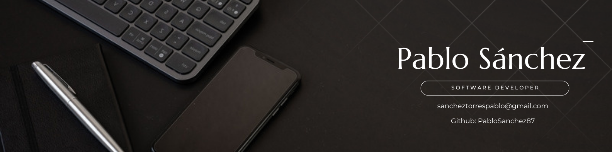

# 👋 ¡Hola! Soy Pablo Sánchez Torres

Soy un **Desarrollador Full-Stack** en desarrollo con más de 2 años de experiencia en Python, especializado en **Back-end**, **Cloud**, y **automatización**. Mi pasión por la tecnología me motiva a aprender constantemente nuevas herramientas y adaptarme a entornos de trabajo desafiantes. Tras una sólida trayectoria en la gestión de un negocio familiar, he decidido redirigir nuevamente mi carrera hacia el desarrollo de software, un campo que siempre me ha apasionado.

---

<!--
## 🚀 Proyectos Destacados

### [Asistente Virtual para Empleados](https://github.com/PabloSanchez87/Web_scrapping_chatbot)
- **Tecnologías**: Python, Streamlit, Web Scraping, OpenAI, RAG
- **Descripción**: Desarrollé un asistente virtual basado en Retrieval-Augmented Generation (RAG) que facilita el acceso a datos históricos para nuevos empleados, optimizando la búsqueda y generación de respuestas para mejorar la elaboración de presupuestos.

### [Generador de Facturas](https://github.com/PabloSanchez87/Utils_with_Python)
- **Tecnologías**: Python, Streamlit
- **Descripción**: Herramienta interactiva para la generación automática de facturas personalizadas en formato PDF, diseñada para la creación de facturas esporádicas de manera eficiente.

### [Chatbot Personalizado](https://github.com/PabloSanchez87/Web_scrapping_chatbot)
- **Tecnologías**: Streamlit, Ollama, Groq, Lang-chain
- **Descripción**: Implementé un chatbot personalizado que proporciona respuestas automáticas basadas en un conjunto específico de datos, mejorando la eficiencia en la atención al cliente.

---

## 🛠️ Habilidades Técnicas

- **Lenguajes de Programación**: Python, Java, SQL, HTML, CSS, JavaScript
- **Frameworks y Herramientas**: Django, Streamlit, Tkinter, OpenAI API
- **Contenerización**: Conocimientos básicos de Docker
- **Gestión de Versiones**: Git, GitHub
- **Cloud**: Microsoft Azure

---

## 📚 Educación & Certificaciones

- **FullStack & Blockchain Developer** - Academia Conquer X (2023 - Presente)
- **Grado en Ingeniería Informática** - Universidad de Santiago de Compostela (70% cursado)
- **Programa Superior en Gestión y Administración de Empresas** - Universidad CEU San Pablo (2011 - 2012)

### Certificaciones:
- **Microsoft Certified: Azure AI Fundamentals (AI-900)** - 2024
- **Microsoft Azure Developer (AZ-204)** - 2024
- **Android Application Development** - 2024

---
-->
## 🌐 Conéctate Conmigo

- **GitHub**: [PabloSanchez87](https://github.com/PabloSanchez87)
- **LinkedIn**: [Pablo Sánchez Torres](https://linkedin.com/in/pablosancheztorres)
- **Email**: sancheztorrespablo@gmail.com

Estoy emocionado por las oportunidades que se presenten en el campo del desarrollo de software y aplicaciones. ¡No dudes en ponerte en contacto conmigo si tienes un proyecto interesante en mente o si buscas colaboración en alguna iniciativa tecnológica!

